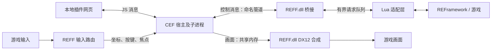

# REFF 运行时架构

本文描述 REFF 的运行时架构、线程边界、资源所有权和插件页面模型。

当前 Shell 采用左侧插件列表、右侧页面容器。`reff.settings` 是唯一固定的 Core 系统项并始终排在第一位，其余页面完全来自动态 manifest。右侧客户区会填满 REFF 窗口分配的可用尺寸；Shell 只保留统一标题栏，插件页面获得其下方的完整内容视口，不能使用固定最大宽度假定窗口尺寸。manifest 通过 `ui.mode` 选择 `component` 或 `isolated-page`：前者由 Shell 的通用 Schema 渲染器承载，后者使用受控 iframe 页面。Shell 不持有第三方插件业务状态。身份由宿主绑定真实页面代次，切页前清理旧订阅。插件资源根固定到 manifest 所在目录，方法和事件由 manifest 与 Lua 注册表共同授权。原生 Present 线程维护可移动、可缩放客户区矩形，CEF 视口与共享帧按最新尺寸调度。

## 1. 进程与模块



游戏进程中的 REFF.dll 负责 REFramework 对接、输入路由、图形合成、IPC 接收及执行调度。浏览器主循环运行在独立宿主中，CEF renderer/GPU 等子进程按内核要求启动，不显示桌面浏览器界面。

CEF 子进程模型与沙箱能力按锁定版本的官方要求配置，不把禁用沙箱作为默认的集成捷径。独立宿主只隔离一部分浏览器故障，不能隔离原生插件或游戏调用产生的崩溃。

| 模块 | 职责 | 不承担的工作 |
| --- | --- | --- |
| REFramework adapter | 初始化、版本检查、回调注册、生命周期 | 修改 REFramework 核心或全局接管其他插件 |
| Renderer | 最新画面上传、DX12 合成、资源回收 | 页面布局、游戏业务方法 |
| Input router | 显隐、焦点、鼠标/键盘/IME 转发和游戏输入协调 | 自动保证所有游戏输入机制兼容 |
| Bridge / scheduler | 会话、请求校验、有界队列、超时、结果返回 | 在 IPC 线程直接执行 Lua |
| Lua SDK | 插件注册、handler/事件、就绪状态 | 把游戏 Hook 同步转交网页 |
| Browser host | CEF 生命周期、本地资源加载、页面通信、画面输出 | 直接持有游戏对象地址 |
| Web SDK / Shell | Promise 调用、订阅、插件页面管理；Shell 内部统一承载 Vue 3、Vite 与 Element Plus 组件 | 直接读写游戏内存；插件重复打包组件库 |
| Core settings | 系统设置校验、持久化、输入路由快照和窗口几何恢复 | 翻译第三方页面；在 Present/窗口线程执行磁盘 I/O |

## 2. 初始化与关闭

1. REFramework 加载通用 DLL；Core 从初始化参数读取 `target_name`，选择游戏能力档案并检查渲染器。未认证组合在安装游戏输入 Hook 前停止初始化。
2. 注册必要回调，准备会话和桥接。DllMain 仅做必要的轻量操作。
3. Lua 状态可用后安装桥接入口；同时处理 REFF 在 Lua 状态创建前后初始化的情况。
4. 默认首次打开面板时启动宿主；记录冷启动时间。若保留宿主，则后续为热打开。
5. 管道握手验证协议、会话和 Runtime 版本，然后加载 Shell 与已注册插件。
6. 页面和桥接均就绪后，通知插件可以接管 UI。
7. 游戏退出时使请求失效、解除输入捕获、通知宿主退出并回收资源；禁止在 DllMain 中等待复杂关闭流程。

宿主与子进程在游戏退出后应自动结束。采用明确的进程树/Job Object 管理或等价机制，避免遗留进程。

## 3. 图形路径

公共窗口使用可配置的逻辑尺寸和物理像素尺寸；实际渲染像素尺寸按 DPI 计算，窗口逻辑尺寸与物理像素尺寸不能混用。

CPU 路径：CEF OnPaint → 共享内存缓冲 → 游戏侧读取完整的一代画面 → GPU 上传 → Present 回调中合成。选定版本的通道顺序、透明度约定和色彩空间必须实际核实，建议显式使用 BGRA8 和经确认的预乘 Alpha 规则。

- 共享缓冲使用固定数量的槽位、序号和明确所有权；尺寸、stride、长度和 generation 必须校验。
- 渲染线程不等待浏览器生产画面，没有新画面时复用已完成纹理。
- 可以丢弃过期画面，不能读到半写入的数据。启用脏区域优化时，跨丢帧/尺寸变化必须正确合并损坏区域或回退完整上传。
- DX12 命令资源、上传缓冲和纹理由 fence 管理，不能在 GPU 使用期间重用或释放。
- 窗口调整、swapchain 重建或设备重置后，使旧画面资源失效并重新协商尺寸；重建失败时关闭面板并释放输入。
- 使用 REFramework 公开的设备、交换链、队列和回调，并遵守资源状态与菜单叠放约束。

GPU 共享纹理是优化候选，不是首版先决条件。仅在 CPU 路径未满足预算或高分辨率需求明确时推进；需要单独验证跨进程句柄、适配器一致性、纹理寿命和同步协议。

## 4. 输入与焦点

运行状态至少区分 Hidden、Opening、Visible、Recovering、Unavailable。

| 状态 | 输入行为 |
| --- | --- |
| Hidden / Unavailable | REFF 不捕获游戏输入 |
| Opening | 页面未就绪前不长期占用输入；超时可关闭 |
| Visible | 焦点进入面板，协调屏蔽对应游戏操作，支持退出键和配置快捷键 |
| Recovering | 立即释放捕获并恢复游戏输入，避免故障锁住玩家 |

Esc 优先交给页面关闭下拉框/内部弹层，无内部操作时关闭 REFF；保留宿主级关闭快捷键，不能依赖网页脚本正常运行才能关闭。

鼠标坐标需要从游戏客户区映射到面板物理像素及网页逻辑坐标。Alt-Tab、失焦和切换 REFramework 菜单时必须释放按键/捕获，恢复时重新建立焦点，避免按键卡住。

Windows 消息拦截不能代表 Raw Input、轮询按键或 XInput 已被屏蔽。各游戏的实际输入路径需要分别验证；DirectInput 等能力由游戏档案选择，不能依赖 exe 名散落判断。中文 IME 包含组合文本、候选窗位置及焦点恢复，不能只验证英文字符输入。

键盘和鼠标穿透是两个独立的 Core 开关。F8、Esc、窗口移动/缩放始终捕获；文本或 IME 聚焦期间键盘强制捕获。其余已转发给 CEF 的消息按开关决定是否继续交给游戏窗口过程。

## 5. 调度与线程

CEF 线程及 IPC 工作线程只校验和排队请求，不直接访问 Lua 状态、游戏对象或游戏 SDK。Lua/游戏 handler 在验证过的 application entry 阶段执行，阶段名称及适用操作由 adapter 和插件共同约定。

渲染回调只处理图形工作。禁止等待 JS 响应、执行磁盘读取、编译页面或进行长时间锁等待。Lua 互斥锁只能保护 Lua 并发访问，不能解决游戏方法的时序要求。

游戏请求采用有界队列与单次调度预算；具体初值见插件契约。预算只限制是否继续取下一项，不能抢占已进入的 Lua/C++ handler。耗时任务必须自行拆分，反复超时的插件应停止接收新请求并提供诊断。

## 6. 恢复与数据所有权

- 插件后端持有权威状态，网页持有可重建的展示缓存。
- Reset Scripts 开始时增加 Lua epoch，清空旧注册/订阅和待执行请求；拒绝旧响应。重新注册完成后页面重新取状态。
- 插件卸载只清理该插件的 handler、订阅和 UI；共享宿主继续服务其他插件。
- 宿主崩溃时恢复游戏输入、使页面就绪状态失效。允许有限重启，例如每分钟最多两次；超过后停用并提供手动重试。
- 宿主重连不自动重放写操作，避免重复修改游戏状态。
- Core 设置不属于 Lua epoch，Reset Scripts 不清空；配置写入 `data/REFF/settings.json`，窗口线程只提交内存几何，服务线程负责落盘。
- 原生/游戏调用不是事务，不能保证失败后回滚；网页必须能够重新获取当前状态。

## 7. 本地资源与通信边界

正式运行只加载本地页面、字体、图标和 Element Plus 资源。Shell 使用 `reff://shell/...`，manifest 资源存放在 `reff/plugins/<plugin-id>/`；禁止 CDN、远程字体和运行时外部请求。

Shell 与插件页面使用独立来源的 frame；桥接身份由宿主根据真实 frame/注册关系绑定，不能信任消息中的 pluginId。限制导航、新窗口、下载、外部协议、远程请求及页面不需要的浏览器权限；CSP 与宿主请求检查共同执行。

路径映射必须规范化，限制在已注册插件资源根目录，处理编码路径穿越及重解析点越界。JS 不直接读取命名管道凭证、共享内存句柄或任意磁盘路径。

IPC 使用当前用户可访问的本机命名管道、按游戏进程区分的会话名和随机会话校验值；不得让一个游戏实例接到另一个实例。网页资源隔离不等于原生 Mod 沙箱。

## 8. 拟议目录

开发目录按职责分层：

```text
native/plugin/       REFF.dll 与 REFramework adapter
native/host/         CEF 宿主
native/common/       协议与公共类型
web/sdk/             无框架依赖的 TypeScript SDK
web/shell/           Vue 3 + Vite + Element Plus 公共 Shell 源码
web/plugins/         可选示例插件页面；不进入默认 staging
lua/                 Lua SDK 与核心 bootstrap
examples/lua/        可选示例插件注册脚本
tests/               协议、调度、恢复等必要测试
tools/               构建、打包、部署脚本
docs/                设计、验证记录和版本清单
```

测试安装布局草案：

```text
reframework/
  plugins/REFF.dll
  autorun/REFF.lua
  autorun/REFF.examples.lua      仅开发示例构建
  autorun/reff/                  Lua SDK 与桥接模块
  reff/ui/                       Shell 与公共前端资源
  reff/runtime/                  CEF 运行依赖
  reff/plugins/<plugin-id>/      manifest 与插件网页资源
  data/REFF/log/                 REFF 专用诊断日志
```

CEF 私有依赖通过经过验证的 DLL 搜索/启动方式加载，不修改系统 PATH，不全局改变游戏进程 DLL 搜索策略。分包布局需要通过干净环境的启动验证，不能仅在开发机上验证。
